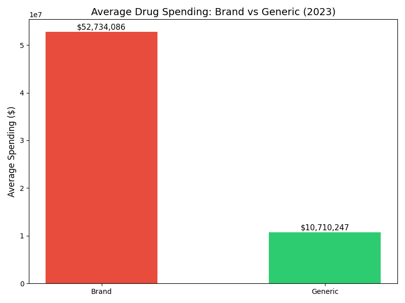
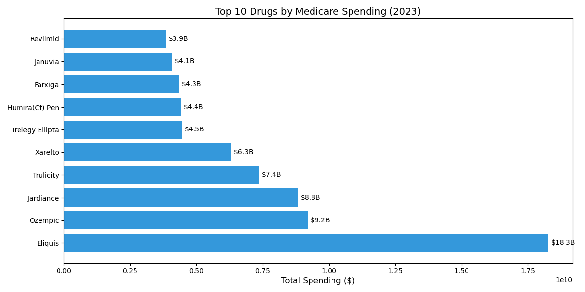
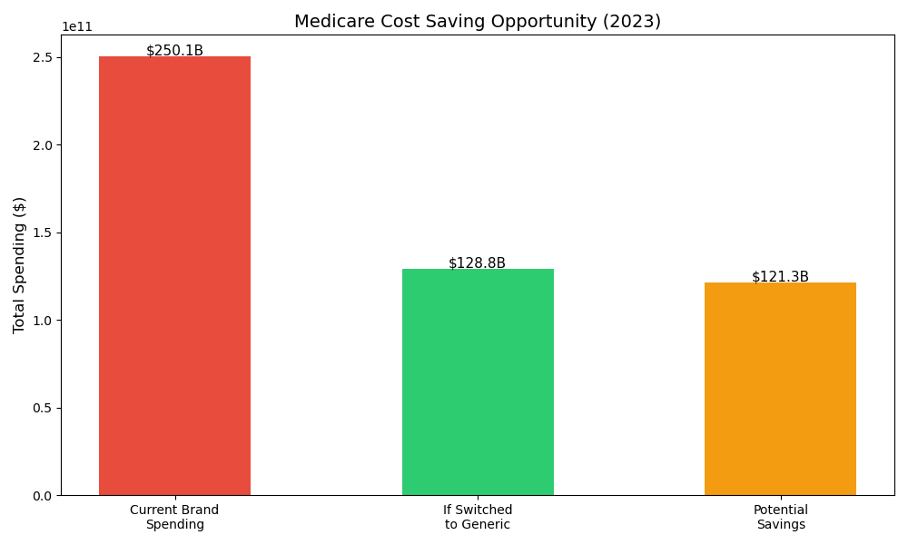
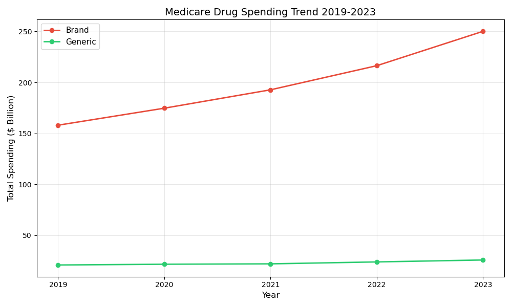

# Medicare Drug Spending Analysis

## Project Overview

This project analyzes Medicare Part D drug spending data from 2019–2023 using publicly available CMS datasets.

The objective is to understand prescription drug spending patterns, compare brand and generic drug costs, identify high-spending medications, and explore potential cost-saving opportunities.

---

## Business Problem

Prescription drug spending remains one of the largest healthcare expenses in the United States.

Healthcare organizations, Pharmacy Benefit Managers (PBMs), and government programs continuously seek opportunities to reduce costs while maintaining patient access to effective medications.

This project explores Medicare drug spending trends and evaluates potential areas for cost optimization.

---

## Data Source

**Source:** Centers for Medicare & Medicaid Services (CMS)

**Dataset:** Medicare Part D Drug Spending Dashboard

**Coverage Period:** 2019–2023

---

## Technologies Used

* Python
* Pandas
* Matplotlib
* Data Cleaning
* Exploratory Data Analysis (EDA)
* Healthcare Cost Analysis

---

## Project Structure

```medicare-drug-analysis/
│
├── main.py
├── dashboard.py
├── analysis/
│   └── analyzer.py
├── data/
│   └── drug_spending_2023.csv
├── charts/
│   ├── brand_vs_generic.png
│   ├── top10_drugs.png
│   ├── cost_savings.png
│   └── spending_trend.png
└── README.md
```

---

## Methodology

1. Data acquisition and validation
2. Data cleaning and preprocessing
3. Drug classification (Brand vs Generic)
4. Spending comparison analysis
5. Trend analysis (2019–2023)
6. Cost-saving scenario evaluation

---
## Interactive Dashboard

An interactive Streamlit dashboard was developed to support dynamic exploration of Medicare drug spending data.

The dashboard allows users to:

* Explore spending patterns through interactive visualizations
* Compare brand and generic drug spending
* Analyze top-spending medications
* Review Medicare spending trends over time

Run locally:

```bash
streamlit run dashboard.py
```

---

## Analysis Results

### 1. Brand vs Generic Drug Spending

Key Finding:

* Brand drugs cost approximately 5 times more than generic drugs on average.


---

### 2. Top 10 Drugs by Medicare Spending

Key Findings:

* Eliquis was the highest-spending Medicare drug in 2023.
* A relatively small number of drugs account for a significant share of total Medicare spending.



---

### 3. Cost Saving Opportunity Analysis

A hypothetical generic substitution scenario was created to estimate potential spending reductions.

Key Finding:

* Significant savings may be possible when lower-cost generic alternatives are available.



#### Note

This estimate is based on average spending differences between brand and generic drugs.

The analysis is intended as an illustrative scenario and does not assume that every brand drug has a clinically equivalent generic alternative.

---

### 4. Medicare Spending Trend (2019–2023)

Key Finding:

* Brand drug spending remained substantially higher than generic drug spending throughout the period analyzed.



---

## Key Insights

* Brand medications are a major driver of Medicare spending and consistently account for substantially higher costs than generic alternatives.
* Medicare spending is highly concentrated among a small number of drugs, suggesting targeted cost-management strategies may have outsized impact.
* Generic utilization represents a potential opportunity for reducing healthcare expenditures when clinically appropriate alternatives are available.
* Data-driven spending analysis can help policymakers, insurers, and healthcare organizations identify high-cost areas and prioritize intervention efforts.
---

## Future Improvements

* Analyze drug categories (Cardiovascular, Diabetes, Oncology, etc.)
* Build spending forecasting models
* Incorporate PBM-focused utilization metrics
* Deploy the Streamlit dashboard as a public web application
---

## Project Motivation

Having worked in a pharmacy-related environment, I became interested in understanding Medicare drug spending patterns and exploring data-driven opportunities for cost optimization using publicly available healthcare data.
